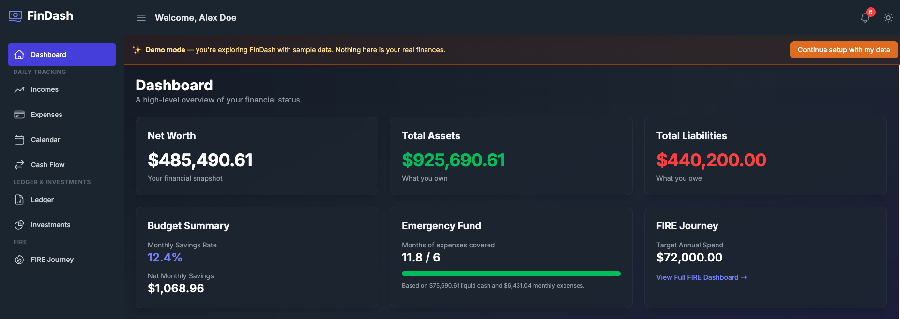
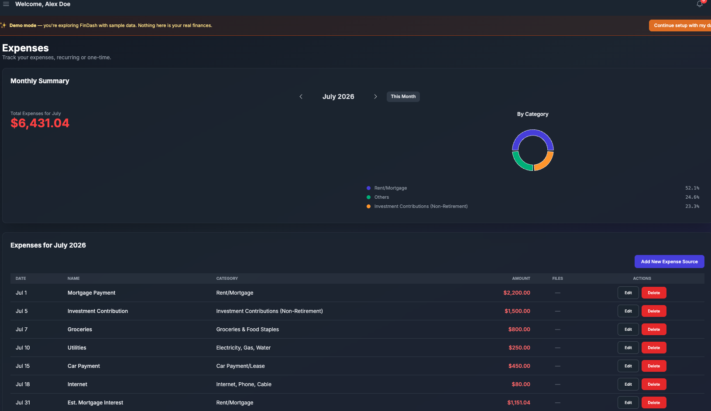
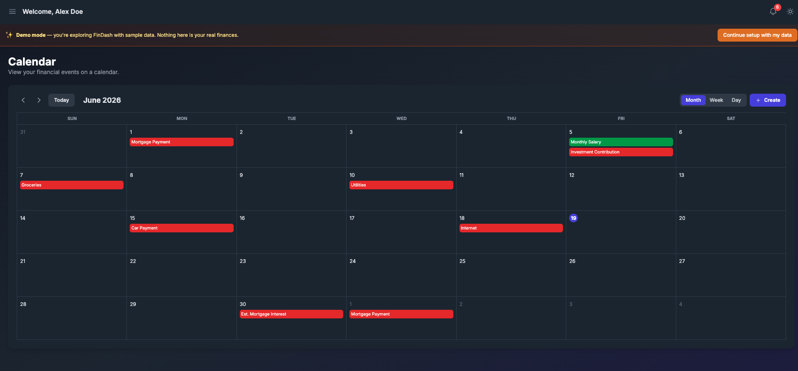
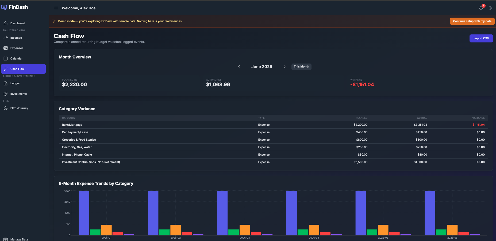
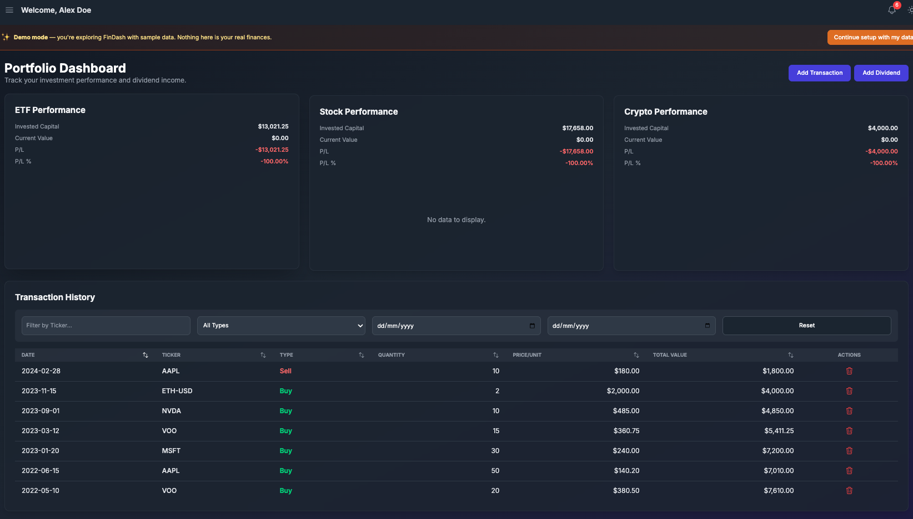
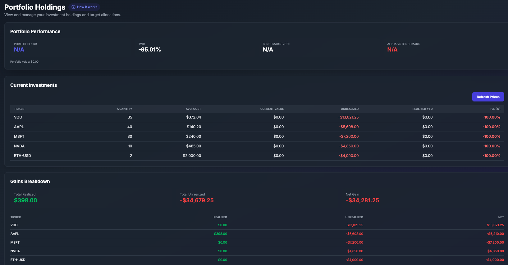
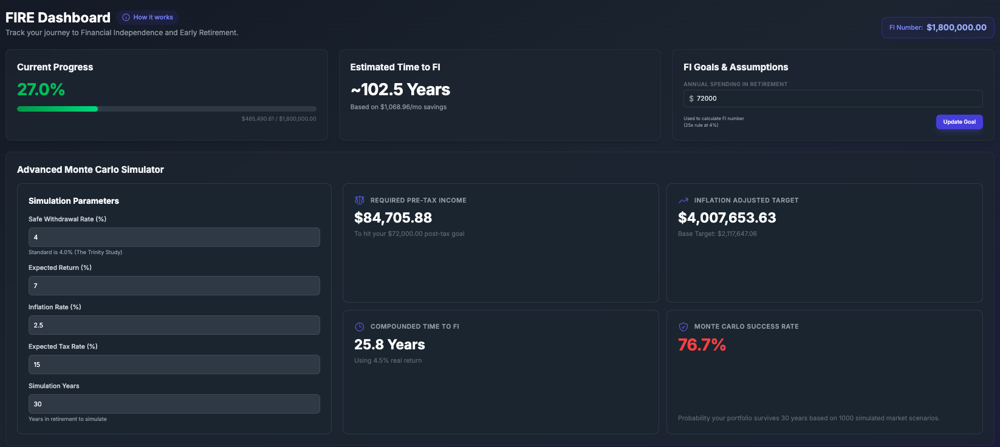
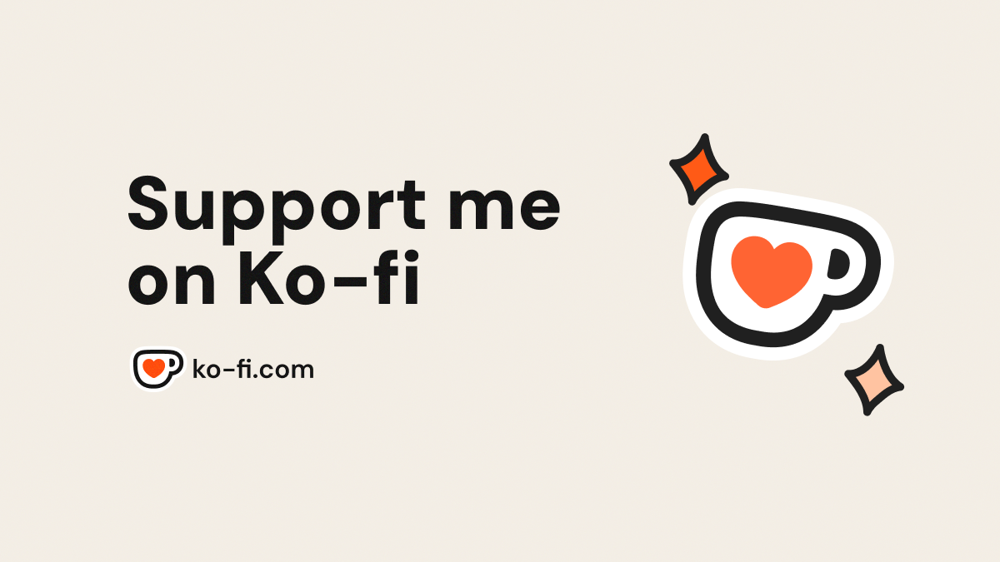

<div align="center">

</div>

# FinDash - Net Worth & FIRE Tracker

**FinDash** is a modern, privacy-focused personal finance dashboard designed to help you track your **Net Worth** and monitor your progress toward **FIRE** (Financial Independence, Retire Early).

Built with **React**, **TypeScript**, and **Vite**, it runs entirely in your browser. Your financial data is stored securely in your browser's local storage—no external database required.

## 📸 Screenshots

### Dashboard & daily tracking

| Dashboard | Expenses | Calendar |
| --- | --- | --- |
|  |  |  |

### Cash flow, investments & FIRE

| Cash Flow | Ledger | Investments |
| --- | --- | --- |
|  |  |  |

| FIRE Journey |
| --- |
|  |

*Screenshots use the built-in demo profile so you can explore the app before entering your own data.*

## 🚀 Key Features

*   **📊 Net Worth Dashboard**: Visualize your financial health in real-time. Automatically aggregates your **Assets** (Cash, Stocks, Crypto, Property) and **Liabilities** (Loans, Mortgages) to calculate your Net Worth.
*   **🔥 Dedicated FIRE Dashboard & Monte Carlo Simulator**: 
    *   Track your "Freedom Number" and journey to early retirement. 
    *   **Advanced Engine**: Set custom Safe Withdrawal Rates (SWR), account for inflation, and simulate pre-tax vs post-tax requirements.
    *   **Monte Carlo Probabilities**: Runs thousands of simulated market paths to calculate the exact probability your portfolio will survive your chosen retirement duration.
*   **📈 Advanced Investment Portfolio & Rebalancing Engine**: 
    *   Dedicated holdings page to track buy/sell transactions and live pricing.
    *   **Portfolio analytics**: XIRR/TWR performance vs benchmark, FIFO realized/unrealized gains, dividend yield-on-cost, diversification breakdowns, and tax-loss harvesting suggestions.
    *   **Algorithmic Rebalancing**: Define target allocations (e.g. 80% VOO, 20% AAPL), input new capital, and the engine will calculate the exact buy/sell trades required to reach equilibrium.
    *   Visual Pie Charts comparing Current vs Target Allocation.
*   **💰 Budgeting Engine**: 
    *   Manage recurring Incomes and Expenses (e.g., salary, rent, subscriptions).
    *   Smart projections: Automatically generates future financial events based on your recurring settings.
    *   **Cash Flow analytics**: Budget vs actual variance, category trends, and bank CSV import.
*   **🔔 Alerts**: In-app notifications for upcoming bills, low cash, rebalance drift, and FIRE milestones.
*   **📊 Comprehensive Data Visualization**: 
    *   **Historical Net Worth Tracking**: Automatically records your net worth monthly, visualized via a dynamic Line Chart.
    *   **Asset Allocation Heatmap**: An interactive Treemap that visualizes the proportion of your entire portfolio.
    *   **Financial Calendar**: A visual calendar view of your month. See exactly when bills are due, when income arrives, and when dividends are paid.
*   **🌗 Theming**: Fully responsive design with native Dark and Light modes.
*   **☁️ Data Portability & Automated Sync**: 
    *   **Zero-Knowledge Architecture**: All data lives strictly in your browser (`localStorage`). No external databases.
    *   **Automated Backups**: Connect a local folder (like your Google Drive desktop folder) and FinDash will silently back up your complete profile to a JSON file every hour.
    *   **JSON Exports**: Export your tabular data (transactions, budgets) directly as JSON files.
    *   **Full JSON Import/Export**: Instantly transfer your entire profile to a new device.
*   **🤖 Google Gemini AI Assistant**: 
    *   Integrate your own Gemini API key to activate a smart financial chatbot.
    *   Ask questions about your net worth, expenses, and FIRE progress.
    *   **Quick Action Chips**: One-tap prompts for common actions like adding expenses or summarizing net worth.
    *   Guided step-by-step assistant for logging new earnings and expenses directly via chat.

## 🛠️ Tech Stack

*   **Core**: [React 19](https://react.dev/), [TypeScript](https://www.typescriptlang.org/), [Vite](https://vitejs.dev/)
*   **Styling**: [Tailwind CSS](https://tailwindcss.com/)
*   **Charts**: [Recharts](https://recharts.org/)
*   **Routing**: [React Router v7](https://reactrouter.com/)
*   **Data Persistence**: LocalStorage (Browser)
*   **APIs**: 
    *   **Local Price Server** (Yahoo Finance via yfinance) — live prices, ticker search, historical prices for benchmarks, and sector/country metadata
    *   [Google Gemini](https://aistudio.google.com/) (AI Chatbot Assistant)

## 🏁 Getting Started

### Prerequisites
*   Node.js (v18 or higher recommended)

### Installation

1.  **Clone the repository:**
    ```bash
    git clone https://github.com/yourusername/FinDash-Net-Worth-FIRE-Tracker.git
    cd FinDash-Net-Worth-FIRE-Tracker
    ```

2.  **Install dependencies:**
    ```bash
    npm install
    ```

3.  **Run the application (requires 2 terminal windows):**

    **Terminal 1: Start the Frontend (React)**
    ```bash
    npm run dev
    ```
    Open [http://localhost:3000](http://localhost:3000) in your browser.

    **Terminal 2: Start the Market Data Engine (Python)**
    The app requires a local Python microservice to fetch live stock prices for your portfolio.
    ```bash
    cd price-server
    pip install -r requirements.txt
    python3 main.py
    ```
    *This server will run on http://localhost:8001 and automatically handle rate limiting and caching.*

### 🧪 Testing

This project includes End-to-End (E2E) tests using **Playwright**.

To run the tests, refer to [TECHNICAL_TESTING.md](./TECHNICAL_TESTING.md).

Quick command to run E2E tests:
```bash
python3 scripts/with_server.py --server "npm run dev" --port 3000 -- python3 tests/e2e/test_dashboard.py
```

## 🌐 Deployment

FinDash has two parts that deploy separately:

| Component | Type | Default |
| --- | --- | --- |
| **Frontend** (React/Vite) | Static site | `npm run dev` → port 3000 |
| **Price server** (FastAPI/Python) | API service | `python3 main.py` → port 8001 |

For frontend-only hosting (Vercel, Netlify, GitHub Pages), see [DEPLOYMENT.md](./DEPLOYMENT.md).

### Deploying the price server to Vercel

Vercel can host the Python price server as a serverless API. Deploy it as a **second Vercel project** (separate from the React frontend).

**Prerequisites**
- Repository pushed to GitHub, GitLab, or Bitbucket
- A Vercel account ([vercel.com](https://vercel.com))

**Step 1 — Create the price-server project**

1. In the Vercel dashboard, click **Add New** → **Project**.
2. Import the same FinDash repository.
3. Under **Root Directory**, click **Edit** and set it to `price-server`.
4. Vercel should detect Python and `requirements.txt`. No custom build command is needed.
5. Click **Deploy**.
6. When finished, copy your deployment URL (e.g. `https://findash-prices.vercel.app`).

**Step 2 — Verify the deployment**

```bash
curl https://YOUR-PRICE-SERVER-URL.vercel.app/health
# Expected: {"status":"healthy","cache_size":0}

curl "https://YOUR-PRICE-SERVER-URL.vercel.app/prices?tickers=AAPL"
# Expected: [{"symbol":"AAPL","price":...,"source":"live"}]
```

**Step 3 — Point the frontend at the deployed server**

The frontend reads the price server URL from the `VITE_PRICE_SERVER_URL` environment variable at build time. Defaults to `http://localhost:8001` when unset.

**On Vercel (frontend project):**

1. Open your **frontend** Vercel project → **Settings** → **Environment Variables**.
2. Add:
   - **Name:** `VITE_PRICE_SERVER_URL`
   - **Value:** `https://YOUR-PRICE-SERVER-URL.vercel.app` (no trailing slash)
3. Redeploy the frontend so the variable is baked into the build.

**For local development against a remote server**, create `.env.local` in the project root:

```bash
VITE_PRICE_SERVER_URL=https://YOUR-PRICE-SERVER-URL.vercel.app
```

Restart `npm run dev` after changing `.env.local`.

**Step 4 — Enable in the app**

In FinDash **Settings**, ensure **Local yfinance Server** is enabled (on by default).

### Serverless caveats (Vercel)

- **Cold starts:** The first request after idle time can take several seconds while the function spins up.
- **No persistent cache:** In-memory caching resets between invocations; yfinance may be called more often than on a local server.
- **Timeout:** Hobby plan functions time out after 10 seconds. Large batch price requests may fail — split tickers or upgrade to Pro (60s timeout).
- **Privacy:** Market data requests go to *your* deployed price server, not a FinDash-operated backend. Ticker symbols are sent; your portfolio balances and personal data stay in the browser.

### Alternative hosts (always-on Python)

If you need a traditional long-running server (persistent cache, no cold starts), consider:

| Provider | Notes |
| --- | --- |
| [Render](https://render.com) | Web Service, root dir `price-server`, start command `uvicorn main:app --host 0.0.0.0 --port $PORT` |
| [Railway](https://railway.app) | Deploy from `price-server/`, set start command above |
| [Fly.io](https://fly.io) | Docker or `fly launch` in `price-server/` |

Use the same `VITE_PRICE_SERVER_URL` value (your Render/Railway/Fly URL) when building the frontend.

## ⚙️ Configuration

To unlock the full power of the dashboard, you need to configure a few settings inside the app:

1.  **Market Data (Stock Prices)**: 
    FinDash uses a Python microservice to fetch real-time market data without requiring expensive API keys. For local development, start the server in Terminal 2 (see **Getting Started**). For production, deploy the price server separately and set `VITE_PRICE_SERVER_URL` (see **Deployment**).
    
    **Enable in App**:
    In FinDash **Settings**, ensure the **Local yfinance Server** toggle is enabled (it is ON by default).

2.  **Profile & Goals**:
    *   In **Settings**, set your **Target Annual Spending** (this drives the FIRE progress calculations).
    *   Set your preferred **Currency** (e.g., USD, AUD, EUR).

3.  **Google Gemini AI Assistant (Optional)**:
    *   In **Settings**, toggle **Enable Google Gemini Chatbot**.
    *   Enter your **Gemini API Key**.
    *   *Note: You can get a free API key from [Google AI Studio](https://aistudio.google.com/).*
    *   A chat icon will appear in the bottom right corner of the dashboard once a valid key is provided.

3.  **Required Integrations**:
    *   **Python 3.9+**: Required to run the background `price-server`.
    *   **Google Gemini API Key**: Required for the AI Financial Assistant chatbot.

## 🛡️ Privacy & Data Portability

This application is designed with privacy first. **All your financial data is stored locally in your browser's LocalStorage.** No personal financial data is ever sent to a remote server or database managed by this project. Market data requests (ticker symbols only) are sent to your configured price server — locally at `localhost:8001` by default, or your own deployed URL via `VITE_PRICE_SERVER_URL`.

### Data Backup & Migration (Export / Import)
Since there is no centralized database, your data does not automatically sync across devices. To migrate your data (e.g., from your laptop to your phone) or create a safe backup:

**Manual Export/Import:**
1. Go to **Settings**.
2. Scroll down to **Data Backup & Restore**.
3. Click **Export Backup (JSON)** to download your current data file.
4. On your new device, click **Import Backup** and select that `.json` file. Your browser will instantly load your data.

**Automated Cloud Sync (Google Drive / OneDrive / Dropbox):**
FinDash can automatically back up your data to your preferred cloud provider by leveraging their desktop "Sync" folders:
1. Ensure you have your cloud provider's desktop app installed (e.g., Google Drive for Desktop).
2. In FinDash, go to **Settings** > **Background Sync**.
3. Click **Connect Local Sync Folder** and select a folder inside your cloud-synced directory (e.g., `Documents/FinDashBackups`).
4. **Important**: If no backup file exists in that folder, FinDash will automatically create a new `findash-backup.json` for you.
5. The app will now silently update this file every hour, ensuring your cloud storage always has the latest version of your data.

**Technical Specifications & Considerations:**
*   **Storage Limits**: Your browser's LocalStorage typically has a limit of around 5MB. Because FinDash only stores text/JSON data, it is extremely difficult to hit this limit through normal usage, ensuring years of seamless tracking.
*   **Security**: The exported `.json` backup file is **unencrypted plain text** by default. Enable **Encrypt backup with passphrase** in Settings to produce an AES-GCM encrypted `.enc.json` file. Attachments are included in full backups. Please store backup files securely on your local device or inside an encrypted vault/password manager.

---

<div align="center">
  <a href="https://ko-fi.com/waterbear9999" target="_blank">
    
  </a>
</div>
