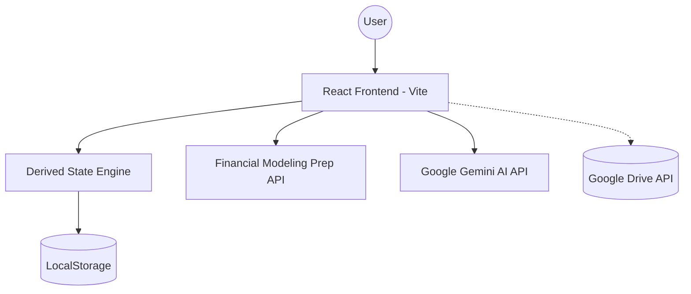

# System Design Architecture: FinDash

## 1. Executive Summary
FinDash is a privacy-first, client-side financial intelligence dashboard. It operates as a "Backendless" Single Page Application (SPA), ensuring that sensitive financial data never leaves the user's local environment except when explicitly synced to user-controlled cloud storage.

## 2. High-Level Architecture

## 3. Component Specifications

### 3.1 Frontend Layer (React 19 + Vite)
- **Framework**: React 19 for declarative UI.
- **Routing**: `react-router-dom` using `HashRouter` for static hosting compatibility. Contains dedicated views for Dashboard, FIRE, Investments, and Management to maximize information density without clutter.
- **Styling**: Tailwind CSS for atomic styling and native Dark Mode support.
- **Visualizations**: Recharts for high-performance SVG-based financial charting.

### 3.2 State & Persistence Layer
- **Local Persistence**: `useLocalStorage` hook synchronizes the React state with `window.localStorage`.
- **Automated Directory Sync**: Leverages the HTML5 File System Access API and IndexedDB to persist a `FileSystemDirectoryHandle`. A background `setInterval` in `App.tsx` silently attempts to write an hourly JSON backup to a connected local directory (e.g. Google Drive synced folder).
- **Derived State Engine**: Heavy use of `useMemo` to aggregate net worth and portfolio metrics from raw transaction ledgers on-the-fly.
- **Data Model**: Atomic, ledger-based transaction history instead of snapshot-based holdings.
- **Algorithmic Rebalancing Engine**: A pure utility function that computes the exact buy/sell monetary differences needed to align a user's current holdings with a target allocation percentage array.
- **Monte Carlo FIRE Engine**: A client-side statistical engine that runs thousands of simulated market paths (using Box-Muller normal distributions) over user-defined retirement durations to output a reliable "Probability of Success" for early retirement given specific Safe Withdrawal Rates, inflation, and tax constraints.

### 3.3 Integration Layer
- **Market Data**: Direct browser-to-API calls to Financial Modeling Prep.
- **AI Insights**: Integration with Google Gemini for synthesized market outlooks.
- **Cloud Sync (Planned)**: OAuth2 integration with Google Drive for automated CSV/JSON backups.

## 4. Technical Constraints
- **Storage Limit**: ~5MB browser LocalStorage quota.
- **Privacy**: No external database; data is unencrypted on the client device.
- **Security**: Relies on browser sandboxing and CORS for API safety.

## 5. Planned Data Portability & Sync (Phase 4)
- **Google Drive Integration**: Use `gapi` (Google API Client) to authenticate users and save/load files to a dedicated `FinDash` folder.
- **CSV Export Engine**: Convert transaction and budget ledgers into standardized CSV formats for external analysis.
- **Automated Sync**: A background interval (or on-demand trigger) to push the latest LocalStorage state to a remote `sync_data.json` on Google Drive.

## 6. Deployment Strategy
- **Static Hosting**: Optimized for Vercel, Netlify, or GitHub Pages.
- **CI/CD**: Automated linting and type-checking via GitHub Actions.
